# Pull Request Automation

**Last Updated:** January 8, 2026  
**Status:** Active  
**Automation Level:** Full

This repository has been configured with automated workflows to handle pull requests without manual intervention.

## Overview

The automation system consists of three main workflows that work together to validate, review, and merge pull requests automatically:

### 1. Auto PR Review and Validation (`auto-pr-review.yml`)

**Triggers:** When a PR is opened, synchronized, reopened, or marked as ready for review

**What it does:**
- ✅ Validates the PR by running:
  - Dependency installation
  - Linting checks
  - Type checking
  - Tests
  - Build process
- 🤖 Auto-approves PRs from Copilot that pass all checks
- 🏷️ Automatically adds relevant labels based on PR content
- 💬 Posts a validation summary comment on the PR

### 2. Auto-merge Approved PRs (`auto-merge.yml`)

**Triggers:** When a PR is approved or when checks complete successfully

**What it does:**
- 🔍 Checks if PR meets merge criteria:
  - Created by Copilot
  - Has at least one approval
  - All checks have passed
  - Not a draft PR
- 🎯 Automatically merges the PR using squash merge
- 📝 Adds a merge confirmation comment

### 3. PR Status Check (`pr-status-check.yml`)

**Triggers:** When a PR is opened, synchronized, or reopened

**What it does:**
- ✓ Verifies PR has a meaningful description
- ✓ Checks if labels are assigned
- ✓ Confirms PR is not a draft
- ✓ Validates reviewers are assigned
- 📊 Posts a readiness checklist comment

## How It Works

```mermaid
graph TD
    A[PR Opened] --> B[PR Status Check]
    A --> C[Auto PR Review & Validation]
    C --> D{Build & Tests Pass?}
    D -->|Yes| E[Auto-approve if Copilot PR]
    D -->|No| F[Manual Review Required]
    E --> G[Auto-merge Workflow]
    G --> H{Meets Merge Criteria?}
    H -->|Yes| I[Squash & Merge]
    H -->|No| J[Wait for Manual Action]
    I --> K[PR Merged ✅]
```

## For Repository Owners

### Existing PRs

The automation will automatically:
1. Validate PR #45 and #46 when the workflows are enabled
2. Approve them if they pass validation (since they're from Copilot)
3. Merge them automatically if all checks pass

### Future PRs

All new PRs will go through the same automated validation and merge process:
- PRs from Copilot that pass checks will be auto-approved and auto-merged
- PRs from other contributors will be validated but require manual approval
- All PRs are labeled automatically based on their content

### Configuration

#### CODEOWNERS
The `.github/CODEOWNERS` file automatically assigns reviewers based on file patterns. Currently configured to assign @Krosebrook to all PRs.

#### PR Template
The `.github/PULL_REQUEST_TEMPLATE.md` provides a standardized template for all PRs with checklists and sections for:
- Description
- Type of change
- Related issues
- Testing details
- Checklist items

### Customization

You can customize the automation by editing these files:

- **Auto-approval criteria**: Edit `.github/workflows/auto-pr-review.yml` (line 69)
- **Auto-merge criteria**: Edit `.github/workflows/auto-merge.yml` (line 61-72)
- **Label assignment**: Edit `.github/workflows/auto-pr-review.yml` (line 88-112)
- **CODEOWNERS**: Edit `.github/CODEOWNERS` to change reviewer assignments

### Disabling Automation

To disable specific automations:
- Delete or rename the corresponding workflow file
- Or add a condition to skip execution in the workflow

### Security Considerations

- Workflows run with limited permissions (`contents: read`, `pull-requests: write`)
- Auto-merge only works for Copilot PRs by default
- All validation checks must pass before auto-merge
- Manual approval can override auto-approval if needed

## For Contributors

When creating a PR:

1. **Use the PR template** - Fill out all relevant sections
2. **Add labels** - Help categorize your PR (automation will also add labels)
3. **Wait for validation** - Automated checks will run within minutes
4. **Review feedback** - Check the validation comment for any issues
5. **Manual review** - PRs from non-Copilot contributors require manual approval

## Monitoring

You can monitor the automation by:
- Checking the "Actions" tab in GitHub
- Viewing workflow run history
- Reading automation comments on PRs
- Checking PR labels and status checks

## Troubleshooting

### PR not auto-merging?

Check if:
- PR is from Copilot (or adjust criteria in `auto-merge.yml`)
- PR has been approved
- All checks have passed
- PR is not a draft

### Validation failing?

Check the workflow logs in the Actions tab for specific error messages.

### Need to bypass automation?

You can always:
- Manually approve and merge any PR
- Close and reopen a PR to retrigger workflows
- Edit the PR to update validation

---

**Last Updated:** December 2025

**Maintained by:** Repository automation system
