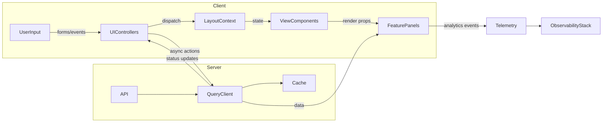

# New Feature Architecture

## 1. UI Component Audit for Extensibility

### 1.1 Design System & Primitive Layer
- **Component Library Structure**: `src/components/ui` consolidates reusable primitives (e.g., `button.tsx`, `dialog.tsx`, `form.tsx`) built atop Radix UI and class-variance-authority, enabling variants via design tokens and utility helpers (`cn`, shared focus/hover classes).
- **Styling Strategy**: CVA-driven variant maps (`buttonVariants`) and Tailwind utility classes allow rapid theme extension without modifying component internals.
- **Accessibility Hooks**: Many primitives wrap Radix components (dialogs, dropdowns, navigation menus), inheriting accessible behavior while exposing composable APIs.
- **Extensibility Considerations**:
  - Keep variant enums in a central token map to prevent divergence.
  - Encourage storybook coverage (existing `.stories.tsx` files) to validate new visual states.
  - Provide fallback props interfaces for aria-* overrides to maintain flexibility.

### 1.2 Layout & Navigation Layer
- **State Coordination**: `LayoutStateManager` supplies page-scoped context (page type, sidebar visibility, wizard state) and centralizes toggles for shell features.
- **Router Aggregation**: `PageRouter`, `ProtectedPageRouter`, and route handler modules orchestrate per-domain layouts, simplifying addition of new route segments.
- **Shell Components**: `AppHeader`, `AppFooter`, `Navigation`, and `Sidebar` provide composable slots (action regions, nav groups) to plug domain-specific affordances.
- **Extensibility Considerations**:
  - Extend `LayoutStateManager` via action creators rather than direct state mutation to keep consumers decoupled.
  - Add feature flags through context value extension with default fallbacks.
  - Maintain route constants registry to ensure new routes participate in breadcrumb and sidebar builders.

### 1.3 Domain Feature Modules
- **Folder-per-Domain**: Each vertical (`analytics`, `automation`, `community`, etc.) encapsulates localized UI, enabling lazy loading and clear ownership boundaries.
- **Integration Patterns**: Many feature components import primitives + layout slots, favoring composition over inheritance.
- **Extensibility Considerations**:
  - Standardize entry points (e.g., `index.ts`) to expose only canonical exports.
  - Document expected props contracts within each domain to assist cross-team contributions.
  - Co-locate tests (`__tests__`) and stories to maintain coverage parity during feature expansion.

### 1.4 Cross-Cutting Observations
- Promote TypeScript `Props` interfaces with JSDoc to describe expectation for new contributors.
- Establish lint rule for exhaustive variant usage to avoid runtime styling drift.
- Consider a central `theme` module for tokens referenced across primitives to maintain theme parity when scaling.

## 2. Component Tree Diagram
The following high-level tree represents the proposed composition for the new feature surface:

```mermaid
graph TD
  AppRoot --> LayoutStateManager
  LayoutStateManager --> ApplicationShell
  ApplicationShell --> AppHeader
  ApplicationShell --> Sidebar
  ApplicationShell --> MainContent
  AppHeader --> HeaderActions
  Sidebar --> NavSections
  MainContent --> FeatureRouter
  FeatureRouter --> FeatureEntry
  FeatureEntry --> {FeaturePanels}
  {FeaturePanels} --> PrimaryPanel
  {FeaturePanels} --> SecondaryPanel
  PrimaryPanel --> InteractionWidgets
  SecondaryPanel --> InsightsStack
```

## 3. Data Flow Diagram



## 4. State Management & Data Strategy
- **Client State**: Extend `LayoutStateManager` context with typed reducers for feature toggles, selection state, and modal visibility. Use discriminated unions for action payloads to maintain strict typing.
- **Server State**: Adopt TanStack Query for data fetching, caching, and background refresh. Configure feature-specific query keys and use `queryClient.invalidateQueries` in mutation success handlers.
- **Form State**: Employ `react-hook-form` integrated with Zod schemas for validation; co-locate schema definitions with feature entry components to enforce contract drift detection.
- **Loading UX**: Standardize skeletons via `src/components/ui/skeleton.tsx` and CTA placeholders using `ff-btn` variants. Provide optimistic UI for high-frequency mutations while showing inline progress indicators.
- **Error UX**: Wrap panels with `ErrorBoundary` and surfacing inline alerts through `Alert` primitive. Log to structured telemetry pipeline and expose retry affordances consistent with layout patterns.

## 5. Accessibility Alignment
- **Roles & Landmarks**: Ensure `ApplicationShell` defines `header`, `nav`, `main`, and `footer` landmarks. Embed `aria-labels` for nav groups matching existing `Navigation` component semantics.
- **Keyboard Navigation**: Leverage Radix-provided focus management; supplement with roving tabindex for custom composites. Guarantee visible focus outlines respecting WCAG 2.1 AA contrast.
- **Announcements**: Integrate `aria-live="polite"` regions for async success/error messages to keep assistive technologies informed.
- **Testing**: Add storybook accessibility checks and use `@testing-library/react` + `axe` for regression testing on core flows.
- **Design Validation**: Schedule audit with design to review color contrast tokens, spacing rhythm, and ensure icon-only buttons expose accessible labels.

## 6. Next Steps
1. Prototype feature entry route within `src/components/layout/PageRouter.tsx` using lazy-loaded boundary.
2. Define TanStack Query layer (`src/lib/query`) with shared error normalization utilities.
3. Extend `LayoutStateManager` actions + context value; provide migration guide for consumers.
4. Add automated accessibility tests to CI (axe + keyboard traversal scripts).
